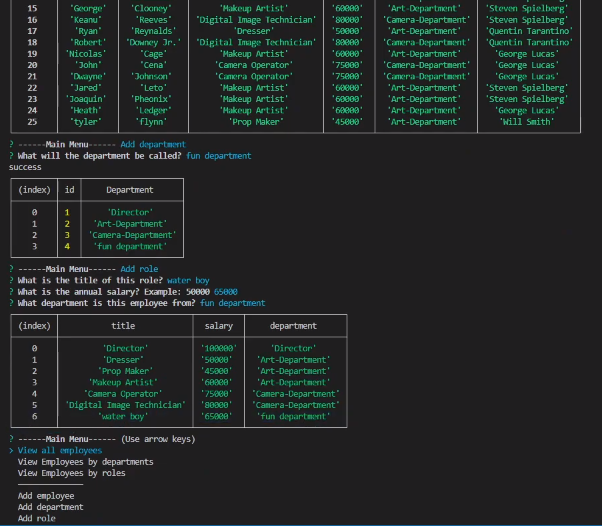

  # Challenge-12: Employee Tracker

  ## Description
  This application is written with MySQL & Javascript to allow users to Create, Read, Update, and Delete (CRUD) employee records detailing roles, departments, and salaries.

  ## Table of Contents
  - [Description](#description)
  - [Installation](#installation)
  - [Usage](#usage)
  - [Demonstration](#demonstration)
  - [Contact](#contact)

  ## Installation
  - After cloning this project, navigate to the location where you've cloned it using the "cd [file location]" command in your CLI of choice (git bash, windows terminal, mac terminal, etc.)
  - Use the command "npm i" in the same location you've cloned this project, in order to install the appropriate node modules & dependencies.
  - Install MySQL to your computer.

  ## Usage
  - Open app.js in a text editor of your choice, and put your MySQL username and password in at line 9 and 10 respectively.
  - Run MySQL in the location you've downloaded this application to, and input your password when prompted.
  - Navigate to the 'db' folder in yoru mysql CLI and use the commands "source db.sql", "source schema.sql", "source seeds.sql" in that order.
  - Open the terminal again in the root directory and use the command "npm start" in your CLI, and you can then interact with the database, as shown below.

  
  ## Demonstration
  - 
  - [Demo of installation and usage](https://youtu.be/VCTaD7SskWo)

  ## Contact
  [GitHub](https://github.com/tyler94flynn)
  [Email](tyler94flynn@gmail.com)
  